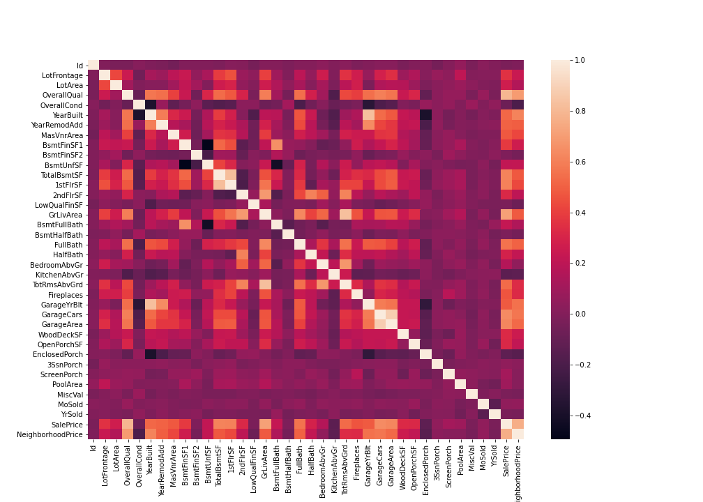
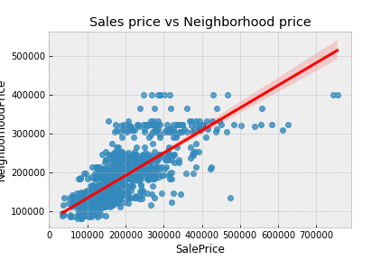
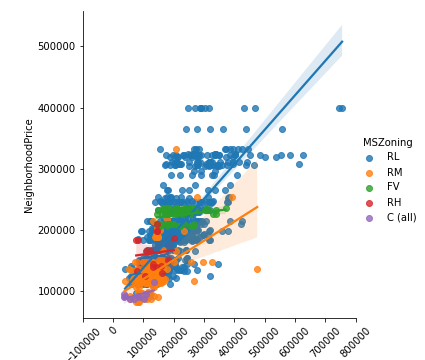
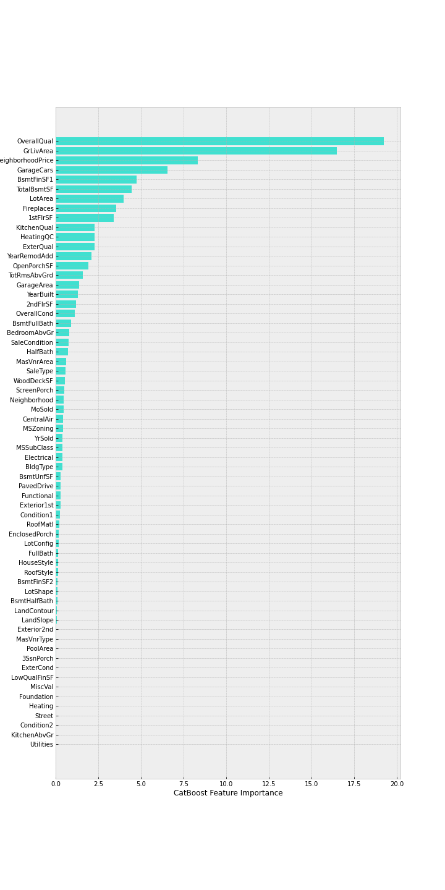
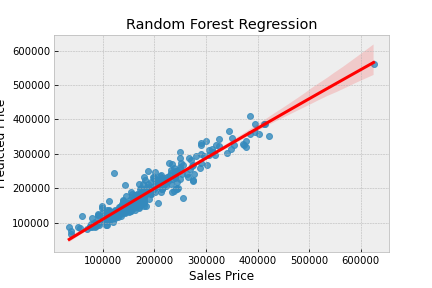
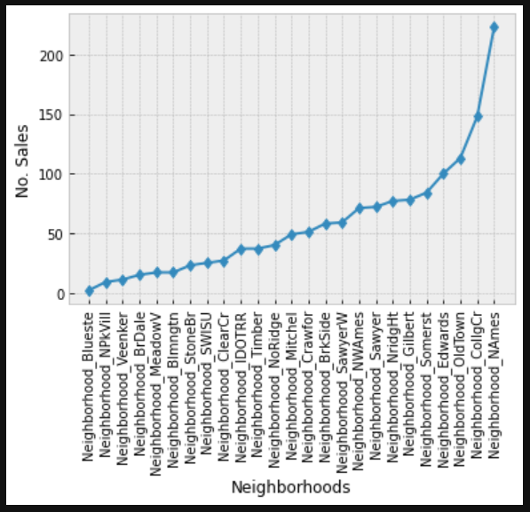

# CapstoneTwo
This is my first capstone, participation in the Kaggle challenge to predict home prices in Ames Iowa 2006-2010.

## 1. Data

Finding the right home is difficult enough but trying to predict how much a home will go for is even trickier.  This challenge gives a number of features of houses sold in Ames Iowa 2006-2010 and allows us to compete in predicting how much a home may go for depending on it's home features like neighborhood, # cars that fit in the garage, lot and home size etc...

> * [Kaggle Dataset](https://www.kaggle.com/c/house-prices-advanced-regression-techniques/data)
> * [Ames Iowa](https://www.google.com/maps/vt/data=im9DfE6g0vL8wC3dDOHSu5eH2ShEMWlPs4BSR8_Yrn9hYIDcmhKkYgs4oXNgSKzIDmbHon4mOyaGIvfaaS5jZ_IqnkkL7dcbMiHlTIOr6nd5AGVlEqJ-IYYemN-hZp-_qfOv0XaF42chHaqhltKMLiVuSBP8XDfqug5T5I4Dnrb3Mt381udqkHi-05obPXOTFQoslPVfqLiUWhAFyXY8YtHHBgAAM5lVnoQ27T19bqmPyDJuX-Oh)
> * [Ames Population Report](https://www.census.gov/quickfacts/amescityiowa)

## 2. Method

Population data, Neighborhood price history are different variables I'd like to calculate to make this work.  The population data may be out of scope, but # of houses sold in the area may be an interesting statistic.

Methods I'm planning on using are Random Forest, Gradient Boosting and Linear Regression.
## 3. Data Cleaning 

[Data Report](https://docs.google.com/presentation/d/1XjOCc1YImvwCIbHPW67iTHKAstYETcm9/edit?usp=sharing&ouid=104857759570776830159&rtpof=true&sd=true)
[Data Cleaning](./Capstone_Two_Part1_Data_Cleaning.ipynb)

In a collaborative-filtering system there are only three columns that matter to apply the machine learning algorithms: the user, the item, and the explicit rating (see the example matrix above). I also had to clean & normalize all the reference information (location, difficulty grade, etc.) to the route so that my user could get a useful and informative recommendation.

* **Problem 1:** Masonry Vaneer types and area's didn't match in cases where type was na (there should have been no area but there was in four instances), and in areas where area was 0 there wer two with vaneer types.  **Solution** The data had to be removed because it was impossible to tell which side was not correctly entered.

* **Problem 2:** Home sales in didn't occur in each neighborhood every year.  There were a few neighborhoods with one to three years in the dataset with not homes recorded as sold. **Solution:** Create a new column with average home sales in each area for each year in the dataset.  Then I took the mean sales price for all years and back/forward filled in the missing dates with that mean. 

* **Problem 3:** Along with numerical data some of the data was categorical and others were ordianal **Solution:** I made two datasets from the original.  The first used Label Encoder to change the non-numeric data into numeric data.  This had the advantage of not increasing the number of features and causing overfitting.  The second approach was to create dummy variables for the categorical values and ordinal numeric variables for the non numeric data.  This preserved the features but increased the number of features from 82 to 255.

## 4. EDA

[EDA Report](./Capstone_Two_Part2_EDA.ipynb)

* In the EDA phase I looked at how the data was related to the features in both datasets.  I found that there were a number of features which had a positive correlation to Sale Price.  These included neighborhood price, Ground floor living area and overall quality.  

* I began testing several algorithms against both datasets

## 5. Algorithms & Machine Learning

I chose to try regression models because my output was a continous variable (Sales Price).  First thing I tried was to do some principal component analysis.  Unfortunately the analysis could only at best capture 44% of the variability and that took over 20 principal components.

Next I tested out a number of machine learning algorithms.
The algorithms I testes were:
* Linear Regression 	       88.48%
* KNN Regression	           74.37%
* Random Forest	               97.96%
* Gradient Boost Regression	   83.90%
* CatBoost Regression	       93.00%

>***NOTE:** There were a number of columns which had a large number of NaN values.  I dropped all the columns with more than 600 NaN values.*
**WINNER: Random Forest Regressor**

I did attempt to do some optomization of the algorithm with the Bayseian method of hyperperameter tuning, but kept getting a pandas error within the optomization code which couldn't deal with some boolians generated wihtin.  CatBoosting on the otherhand did show some improvement over the other methods, but not better than the initial Random Forest regressor.  It did allow me to determint the top features which contributed to the price.

## 6. Which Dataset to choose?

[Final Notebook](./Capstone_Two_Part3_Final)

After choosing the random forest algorithm, I tested the accuracy of all three different filtered datasets. The dataset which I used LabelEncoder performed the most accurate predictions. However random forest also preformed equally well on the dummy variables dataset.  I went with the LabelEncoder dataset because it preformed better on most of the other algorithms as well as random forest, and it was a smaller dataset having less features.

## 7. Predictions

In the final predictions notebook, I created a pipeline for managing the test data as part of the Kaggle competition and generated my final submission for the contest:

This was my first entry into the Kaggle competitions and I earned a score of 0.14816.

## 8. Future Improvements

* In the future, I would love to spend more time trying to capture some of the other possible influences in the areas from other data sources.  For instance population statistics for each of the neighborhoods and I found that there was a vast difference in how many sales occured in each neighborhood which I believe will be an important influencer on home sales prices.

## 9. Credits

Thanks to David Arango PhD. my Springboard mentor and Olivia Ongpin my friend and realtor who gave me advice in what to look at for home buying.  Of course my family for supporting my work on this project and transitioning over to being a full time DataScientist